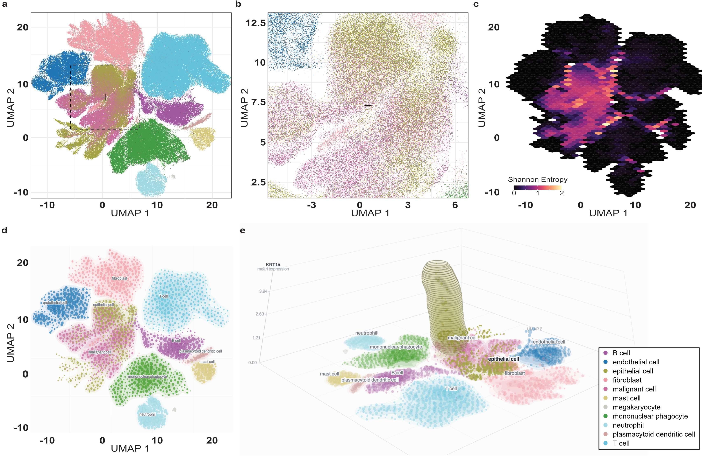
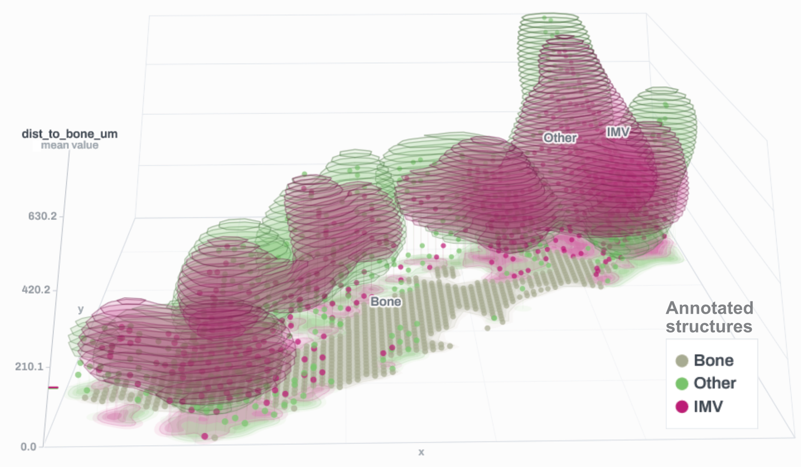
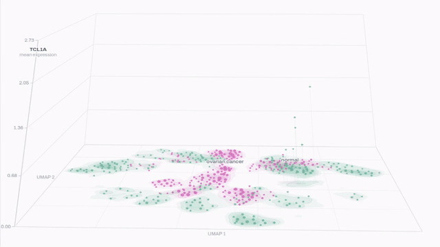
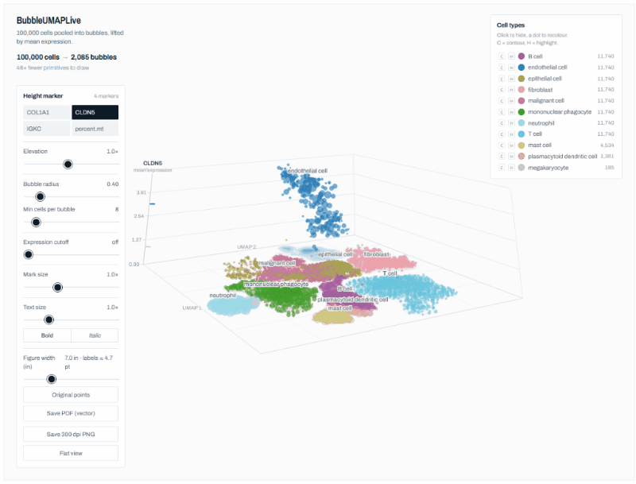

# MANDALA

MANDALA (Multiscale Aggregation and Neighborhood Data Analysis for Local Architecture) 
is an R package that provides effective visualization approaches for large-scale 
single-cell and spatial transcriptomic data, extending beyond traditional scatter plots.

At atlas scale the standard scatter plot of a UMAP embedding stops conveying the
structure it contains: dense regions saturate, local composition becomes
unreadable, and gene expression overlays inherit the same problem. `MANDALA`
provides aggregation-based alternatives that work directly on Seurat objects.

<p align="center">
  
</p>


`MANDALA` can also be used for spatial transcriptomics data visualization.

<p align="center">
  
</p>


MANDALA also provides 3D visualization and interactive data exploration through a Shiny interface (see details below).
<p align="center">
  
</p>


| Function | Output | Purpose |
| --- | --- | --- |
| `BubbleMAP` | static (ggplot) | Density contours with data-driven bubble aggregation |
| `BubbleMAP3D` | interactive HTML | The same representation with an expression height axis, rotatable, plus a flat 2-D view |
| `SpatialMAP3D` | interactive HTML | The same viewer over tissue coordinates rather than an embedding |
| `HexMAP` | static (ggplot) | Hexagonal binning: majority composition, Shannon entropy, mean expression |
| `MagnicMAP` | static (ggplot) | Paired overview and magnified views of a chosen region |
| `MANDALA` | Shiny | Point-and-click access to all of the above |

---

## Installation and Use

```r
install.packages("devtools")
devtools::install_github("merlab/MANDALA")
library(MANDALA)
```

**Requirements:** R >= 4.0, Seurat >= 4.0. Seurat v3, v4 and v5 objects are all
supported; the appropriate `GetAssayData` accessor is selected automatically.

**Suggested packages.** `shiny` for `MANDALA()`, `tcltk` for its folder
dialog, `shadowtext` for haloed labels, `viridisLite` and `ggnewscale` for
`metric_scale = "colour"`, `patchwork` for `MagnicMAP(combine_plots = TRUE)`.

## Shiny interface

`MANDALA()` is the quickest way in. A local Shiny front end over an object already in your session,
nothing is uploaded and there is no size limit beyond your own memory. The following lines can be called right after loading the package. 

```r
MANDALA(sample_scRNA) #choose function BubbleMAP3D for the experience, or
MANDALA(sample_spatial) #choose function SpatialMAP3D.
```

<p align="center">
  
</p>


### Example data

```r
data(sample_scRNA)     # 8 marker genes, 11 annotated cell types, UMAP precomputed
data(sample_spatial)   # bone marrow Visium: 4 genes, 1,714 spots, slice1 image
```


Further information can be found in the vignette via:

```r
vignette("MANDALA") #or
browseVignettes("MANDALA")
```

---

## Citation

If you use MANDALA, please cite:

> Ho, N. J.; Hojeij, H.; Mer, A. 
> MANDALA for Scalable Visualization of Large Single-Cell and Spatial Omics Datasets. *(in preparation)*

## License

GPL (>= 3)
